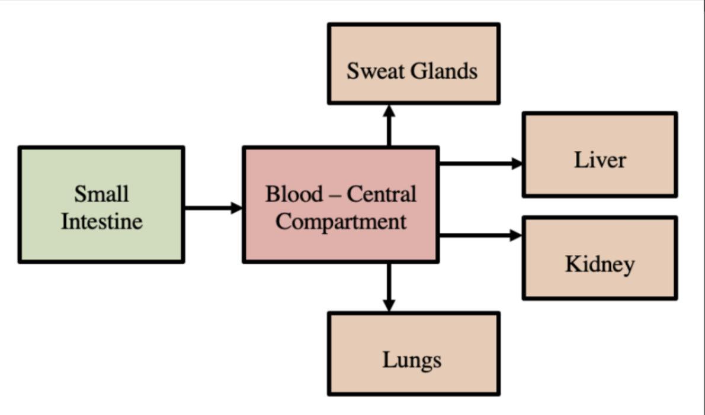
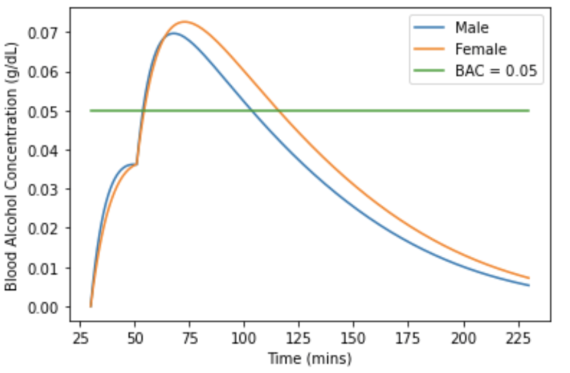

# Blood Alcohol Concentration (BAC) Simulator
## Purpose
Around the world, alcohol misuse is widely recognized as a social issue, especially among young adults. As a way to encourage the population to learn more about the impacts of their drinking behaviours, a Python implementation of a deterministic compartmental model for the pathway of alcohol in the blood was created. The compartmental pathway used in the Python code was proposed by Stephanie Lapadat and is shown below.



## Key Features
The Python model uses Euler's approximation technique to predict an individual's blood alcohol concentration over a set time period and displays a graph of the results as shown below.



The model allows experimentation with the following case-dependent parameters:
- Weight of subject
- Total intake of alcohol
- Number of alcohol intakes
- Average wait time between intakes

## How to Use
First, download BAC.ipynb. Then, open the file and before running the code, adjust the case dependent constants to your desired values.
```python:
# case dependent parameters
W = 60             # weight of individual (kg)
I_tot = 40         # total intake of alcohol (g)
n = 2              # number of intakes (including initial) between which total intake is equally divided
T = 20             # wait time between each intake, if applicable (min)
```        
## How to Contribute
Here are just a few ways that interested individuals can contribute to this project:
- Update the values used for the universal constants in the model
- Add new case-dependent parameters for users to change
- Make model's results more accurate by accounting for even more universal constants
